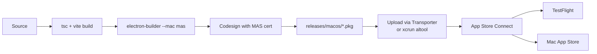

# Mac App Store build

For maintainers shipping Out Loud through the Mac App Store (MAS) or TestFlight. For regular local builds, see [`../app/architecture.md#development-commands`](../app/architecture.md#development-commands) and the [root README build guide](../../README.md#build-from-source).

## Contents

- [Prerequisites](#prerequisites)
- [Pipeline](#pipeline)
- [Commands](#commands)
- [Testing MAS builds](#testing-mas-builds)
- [Entitlements](#entitlements)
- [Troubleshooting](#troubleshooting)
- [See also](#see-also)

## Prerequisites

1. **Apple Developer Account** ($99/year)
2. **Certificates** from Apple Developer Portal:
   - _3rd Party Mac Developer Application_ — signs the app
   - _3rd Party Mac Developer Installer_ — signs the `.pkg`
3. **Provisioning profile** for bundle ID `com.outloud.app`

## Pipeline



## Versioning (CFBundleVersion)

App Store Connect rejects an upload whose `CFBundleVersion` is not **higher** than the last one it accepted, with a 409:

> This bundle is invalid. The value for key CFBundleVersion […] must contain a higher version than that of the previously uploaded version

Two separate keys are involved:

| Key | Comes from | Meaning |
| --- | ---------- | ------- |
| `CFBundleShortVersionString` | `package.json` `version` | Marketing version — what users see |
| `CFBundleVersion` | electron-builder `buildVersion` | Build number — must strictly increase per upload |

**`buildVersion` is deliberately not set** in [`electron-builder.json`](../../electron-builder.json). Left unset, electron-builder defaults it to the `package.json` version, so the build number tracks the release version automatically and cannot drift.

It used to be hardcoded and hand-bumped, and it drifted twice — first 2.0.1 against a 2.0.2 package.json, then 2.1.1 against 2.1.2, which produced exactly the 409 above even though the release had been bumped. `npm version` only edits `package.json`, so any hardcoded value goes stale the moment you cut a release. Don't reintroduce it.

The one legitimate use is **re-uploading under a version App Store Connect has already seen** — a rejected binary, say. Marketing versions don't have to be burned for that: temporarily set a four-component build number and remove it once accepted.

```jsonc
// electron-builder.json — temporary, for a re-upload of an already-uploaded 2.1.2
"buildVersion": "2.1.2.1"
```

Verify before uploading:

```bash
/usr/libexec/PlistBuddy -c "Print :CFBundleVersion" \
  "releases/macos/mas-universal/Out Loud.app/Contents/Info.plist"
```

## Commands

```bash
# Unsigned development build — for inspecting structure
npm run electron:build:mas-dev

# Production build — requires certificates
npm run electron:build:mas
```

## Testing MAS builds

### Unsigned development build

```bash
npm run electron:build:mas-dev
```

Won't launch due to sandbox requirements, but the app bundle in `releases/macos/` is inspectable.

### Signed development build

With certificates in Keychain:

```bash
npm run electron:build:mas
```

Signed `.pkg` lands in `releases/macos/`.

### TestFlight distribution

1. Build a signed MAS package
2. Upload to App Store Connect with Transporter or `xcrun altool`
3. Create a TestFlight build in App Store Connect
4. Invite testers

### Sandbox testing without full signing

```bash
npm run electron:build:mac
codesign --force --deep --sign - \
  "releases/macos/mac-arm64/Out Loud.app" \
  --entitlements build-resources/entitlements.mas.plist
```

## Entitlements

Defined in [`build-resources/entitlements.mas.plist`](../../build-resources/entitlements.mas.plist):

| Entitlement                                              | Purpose                                              |
| -------------------------------------------------------- | ---------------------------------------------------- |
| `com.apple.security.app-sandbox`                         | Required for MAS                                     |
| `com.apple.security.network.client`                      | Outgoing connections only (telemetry, update checks) |
| `com.apple.security.files.user-selected.read-write`      | Save audio exports via the native Save panel         |
| `com.apple.security.cs.allow-jit`                        | ONNX runtime                                         |
| `com.apple.security.cs.allow-unsigned-executable-memory` | ONNX runtime                                         |
| `com.apple.security.cs.disable-library-validation`       | Native dependencies                                  |

> The local extension HTTP server (which would need `network.server`) is disabled in the MAS build per guideline 2.4.5(i), so that entitlement is not declared.
>
> `files.downloads.read-write` was removed: exports go through the user-selected Save panel and the app never writes to `~/Downloads` directly. Apple rejected it under guideline 2.4.5(i) as an entitlement without matching functionality.
>
> JIT and unsigned-memory entitlements may require an exception request from Apple for App Store approval.

## Troubleshooting

### "Code signature invalid"

- Native binaries (onnxruntime, ffmpeg) properly signed?
- Provisioning profile matches bundle ID?

### "App sandbox violation"

- Entitlements include all required permissions?
- File access stays inside sandbox-allowed paths?

### App Store rejection for JIT entitlements

Request an exception from Apple with justification for ONNX runtime.

## See also

- [`../app/architecture.md`](../app/architecture.md) — the code being packaged
- [`../../electron-builder.json`](../../electron-builder.json) — packaging configuration
- [`../extensions/testing.md`](../extensions/testing.md) — Safari App Store path reuses this pipeline
