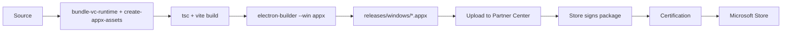

# Microsoft Store build

For maintainers shipping Out Loud through the Microsoft Store as an MSIX/AppX package. For the direct-download Windows installer (`.exe`, NSIS), see [`releasing.md`](./releasing.md) and the [root README build guide](../../README.md#build-from-source). This is the Windows counterpart to [`mac-app-store.md`](./mac-app-store.md).

## Contents

- [Store vs. direct download](#store-vs-direct-download)
- [Prerequisites](#prerequisites)
- [One-time Partner Center setup](#one-time-partner-center-setup)
- [Pipeline](#pipeline)
- [Commands](#commands)
- [The VC++ runtime problem (MSIX-specific)](#the-vc-runtime-problem-msix-specific)
- [What changes in the Store build](#what-changes-in-the-store-build)
- [Testing the package locally](#testing-the-package-locally)
- [Submitting to the Store](#submitting-to-the-store)
- [Troubleshooting](#troubleshooting)
- [See also](#see-also)

## Store vs. direct download

Two independent Windows artifacts, built from the same source:

| Artifact               | Target | Command                     | Distribution                    | Auto-update       |
| ---------------------- | ------ | --------------------------- | ------------------------------- | ----------------- |
| `Out Loud Setup ….exe` | `nsis` | `npm run electron:build:win` | website / GitHub Releases       | in-app (built in) |
| `Out Loud …-x64.appx`  | `appx` | `npm run electron:build:appx` | Microsoft Store (Partner Center) | Store-managed     |

The NSIS installer is unchanged and keeps shipping. The MSIX is a new, additional artifact for the Store.

## Prerequisites

1. **Microsoft Partner Center developer account** — one-time **$19** for an individual (or $99 for a company). Register at <https://partner.microsoft.com/dashboard/registration>.
2. **A Windows build machine** — MSIX packaging uses the Windows SDK's `makeappx`/`signtool`; it cannot be built on macOS/Linux. CI builds it on the `windows-latest` runner (see [`../../.github/workflows/release.yml`](../../.github/workflows/release.yml)); locally you need a Windows box with Node ≥ 22 and the **"Desktop development with C++"** VS workload (supplies both the Windows SDK and the MSVC CRT redist — see the [runtime section](#the-vc-runtime-problem-msix-specific)).

No code-signing certificate is required: **the Store signs the package for you** on submission. We build it unsigned.

## One-time Partner Center setup

Do this once, then paste three values into [`electron-builder.json`](../../electron-builder.json) → `appx`.

1. Register the developer account (above).
2. In Partner Center → **Apps and games → New product → MSIX or PWA app**, **reserve the name** `Out Loud` (or the closest available). Reserving the name mints your app's package identity.
3. Open the reserved app → **Product management → Product identity**. Copy the three values and replace the `REPLACE_WITH_…` placeholders in `electron-builder.json`:

   | Partner Center field       | `electron-builder.json` key | Example                                      |
   | -------------------------- | --------------------------- | -------------------------------------------- |
   | **Package/Identity/Name**  | `appx.identityName`         | `12345Publisher.OutLoud`                     |
   | **Package/Identity/Publisher** | `appx.publisher`        | `CN=ABCD1234-…-1234567890AB`                 |
   | **Publisher display name** | `appx.publisherDisplayName` | `Julia Kafarska`                             |

   > These must match Partner Center **exactly**, or the Store rejects the upload with a manifest/identity mismatch. `publisher` is the raw `CN=<GUID>` string, not your name.

`appx.applicationId` (`OutLoud`) and `appx.displayName` (`Out Loud`) are ours to choose and don't need to match anything; leave them.

## Pipeline



## Commands

```bash
# Microsoft Store package. Windows only. Stages the CRT DLLs, regenerates the
# tile assets, then builds an unsigned .appx into releases/windows/.
npm run electron:build:appx
```

Regenerate the Store tile/logo assets on their own after changing the source icon (`electron/icon.png`); this runs on any OS:

```bash
node scripts/create-appx-assets.mjs   # -> build-resources/appx/*.png
```

## The VC++ runtime problem (MSIX-specific)

`onnxruntime-node`'s native binary depends on the Microsoft Visual C++ runtime (`msvcp140.dll`, `vcruntime140.dll`, `vcruntime140_1.dll`), which fresh Windows installs don't ship.

The NSIS installer solves this by running `vc_redist.x64.exe` at install time ([`installer.nsh`](../../build-resources/installer.nsh)). **MSIX packages can't run installers** — they're declarative. So the Store build instead ships those DLLs **app-local**, next to `Out Loud.exe`, where Windows' default DLL search order finds them:

- [`scripts/bundle-vc-runtime.mjs`](../../scripts/bundle-vc-runtime.mjs) copies the CRT DLLs out of the machine's Visual Studio "Redist" folder into `build-resources/win-runtime/`.
- [`electron-builder.json`](../../electron-builder.json) → `win.extraFiles` places them beside the executable.

The `win-runtime/` directory is kept (via `.gitkeep`) but empty in git; the DLLs are staged at build time and git-ignored. The NSIS build reads the same `extraFiles` but leaves the folder empty (it uses the redist installer instead), so its behaviour is unchanged.

> Copying the CRT DLLs app-local from the VS **redist** folder is licensed; copying them from `C:\Windows\System32` is not. The script only reads the redist folder.

## What changes in the Store build

Electron sets `process.windowsStore = true` when the app runs from an MSIX package — the exact analogue of `process.mas`. Two behaviours are gated on it (mirroring the Mac App Store decisions):

| Feature                        | Store build | Where                                             |
| ------------------------------ | ----------- | ------------------------------------------------- |
| Localhost extension API server | **off**     | [`electron/main.ts`](../../electron/main.ts) (`storeBuild` gate) |
| In-app update checks/banners   | **off**     | [`electron/update-check.ts`](../../electron/update-check.ts) — the Store owns updates |

The browser-extension bridge is therefore unavailable in the Store build, same as in the MAS build. Everything else (offline TTS, exports via the native Save dialog, telemetry) works identically.

## Testing the package locally

On a Windows machine:

```bash
npm run electron:build:appx
```

The unsigned `.appx` lands in `releases/windows/`. To run it before Store submission you must sideload it, which requires a signature Windows trusts. Two options:

1. **Self-signed test cert** — sign the `.appx` with a self-signed cert whose subject matches `appx.publisher`, trust the cert on the test machine (`Import-Certificate` into `Cert:\LocalMachine\Root`), then `Add-AppxPackage`. Fastest for smoke-testing install + launch.
2. **Partner Center flight** — upload and use a hidden/flight submission for real end-to-end validation.

Because the `.appx` in `electron:build:appx` is unsigned, `Add-AppxPackage` on it directly will fail until it's signed by you (test) or the Store (production).

## Submitting to the Store

1. Build the `.appx` (CI produces it as the `desktop-windows-store` artifact on a tagged release; or build locally on Windows).
2. Partner Center → your reserved app → **Packages** → upload the `.appx`.
3. Fill in **Store listing** (description, screenshots, category = *Productivity* or *Utilities*), **Properties**, **Age ratings**, and **Pricing** (Free).
4. Submit for certification. First reviews typically take a few business days.

> The GitHub release job attaches the `.appx` to the draft release for convenience, but end users can't install an unsigned `.appx` directly — it's there for you to hand to Partner Center. Remove it from the public release notes if it's confusing.

## Troubleshooting

### Build fails: "could not locate a Microsoft.VC\*.CRT (x64) redist folder"

`bundle-vc-runtime.mjs` couldn't find the CRT redist. Install the VS **"Desktop development with C++"** workload (or the **"MSVC v143 - VS C++ x64/x86 build tools"** component), or set `VCToolsRedistDir` to the redist path.

### Store upload rejected: identity / publisher mismatch

`appx.identityName`, `appx.publisher`, and `appx.publisherDisplayName` must match Partner Center → Product identity **character-for-character**. Re-copy them.

### App launches but TTS fails only in the Store build

Almost always the app-local CRT DLLs are missing from the package. Confirm `build-resources/win-runtime/` held `msvcp140.dll` etc. at build time and that `win.extraFiles` placed them next to `Out Loud.exe` inside the package (`makeappx unpack` to inspect).

### Certification flags a capability

The `appx` config declares full-trust only (electron-builder's default `runFullTrust`). If cert flags an unexpected capability, inspect the generated `AppxManifest.xml` and trim.

## See also

- [`mac-app-store.md`](./mac-app-store.md) — the Mac App Store counterpart this mirrors
- [`releasing.md`](./releasing.md) — the direct-download release flow
- [`../../electron-builder.json`](../../electron-builder.json) — packaging configuration (`appx` block)
- [`../app/architecture.md`](../app/architecture.md) — the code being packaged
